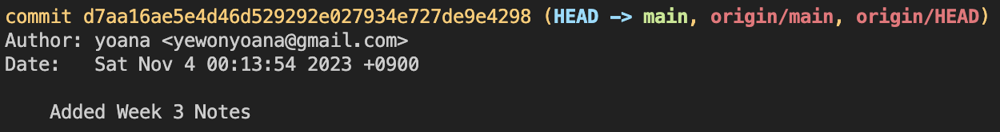

# Terminal Commands

### LOCAL DIRECTORY INTO GIT REPO

- `git init`

---

### CLONE EXISTING REPO

1. Same directory name:
   - `git clone url`
     - git clone https://github.com/yewonyoana/git-study
2. Different directory name:
   - `git clone url name`
     - git clone https://github.com/yewonyoana/git-study git-study-2023

---

### STATUS OF GIT FILES

- `git status`

---

### TRACK NEW FILES

1. For all files in the directory:

   - `git add .`

2. For individual files:

   - `git add file_name`
     - git add README.md

3. For individual folder:

   - `git add folder_name/`
     - git add practice/

4. For an individual file in a folder:
   - `git add folder_name/ file_name`
     - git add practice/ chapter_one.txt

---

### COMMIT FILES

1. Without message:

   - `git commit`

2. With message:

   - `git commit -m "message"`
     - git commit -m "Updated README.md"

3. All changes and skipping staging area:

   - `git commit -a`

4. Amend commit message:
   - `git commit --amend`

---

### PUSH TO GITHUB

- `git push origin main`
  - no other branches, `git push` pushes all files to `main`

### REMOVE FILES FROM STAGING AREA

- `git rm`

---

### MOVE FILES

- `git mv file_from file_to`
  - git mv REAME.md README

---

### COMMIT HISTORY

1. `git log`

   - `commit # (HEAD -> main)` = my computer
   - `commit # (origin/main)` = gitHub repository

     

   - `commit # (HEAD -> main, origin/man)` = computer and gitHub repo are in the same commit

      

2. `q`

   - exit from `git log`

---

### GIT PULL

- `git pull origin main`

---

### GIT CHECKOUT

1. Checking out a past commit:

   - `git checkout #`
     - git checkout d7aa16ae5e4d46d529292e027934e727de9e4298

2. Checking out the latest commit:
   - `git checkout main`

---

### RESET (DELETE) COMMIT

1. Reset commit:
   - `git reset (--hard, ) #`
     - `#` : `HEAD^`, `HEAD~`, commit #
2. Push changed commit to Origin:
   - `git push origin main --force`

#### Hard Reset

- `git reset --hard HEAD^`

#### Soft Reset

- `git reset --soft HEAD^`

#### Mixed Reset

- `git reset HEAD^`

---

### REVERT COMMIT

- `git revert commit#`
