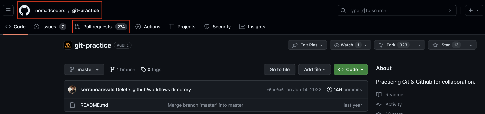
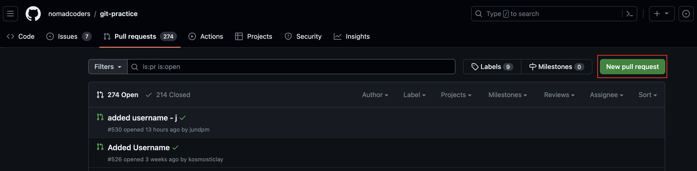
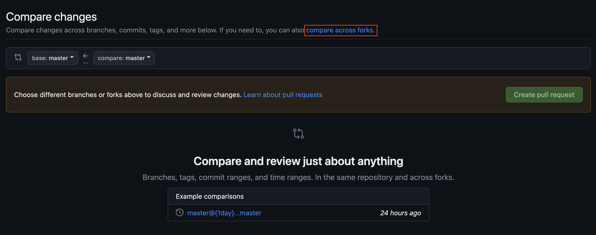
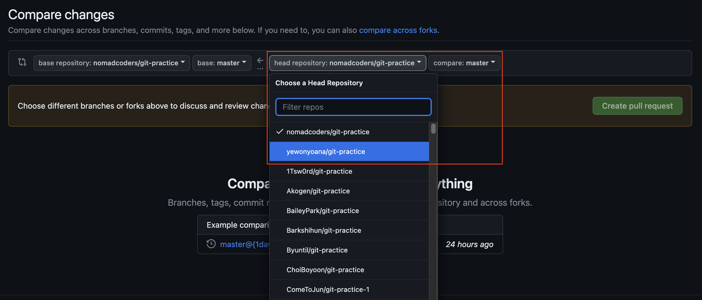
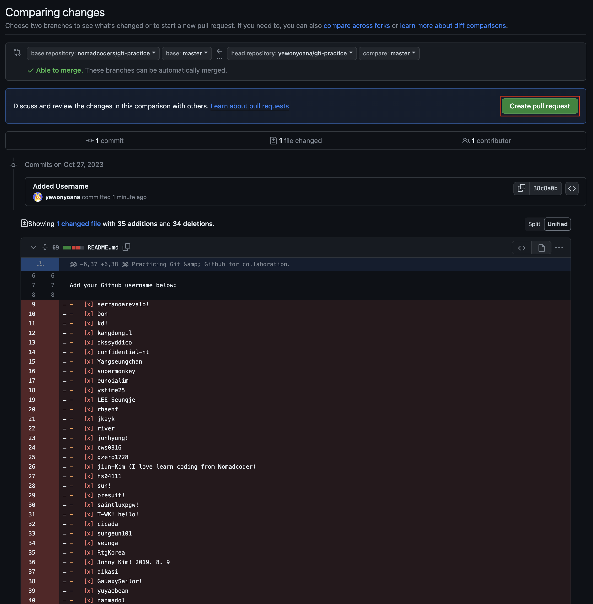
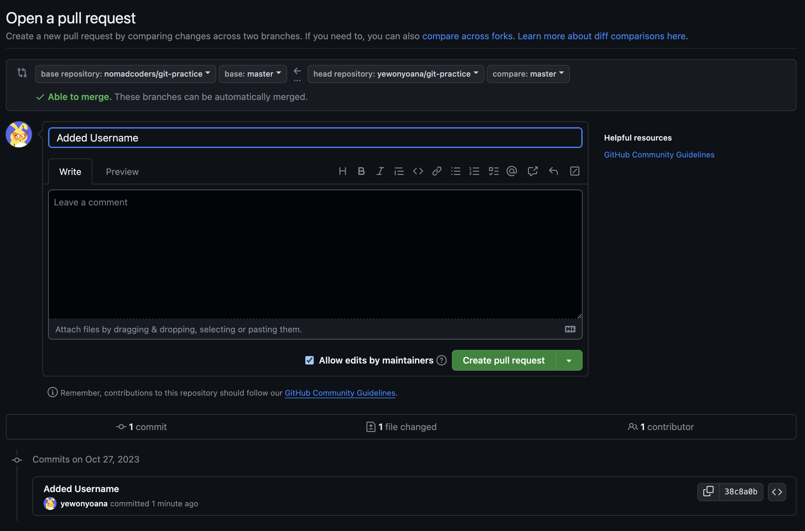
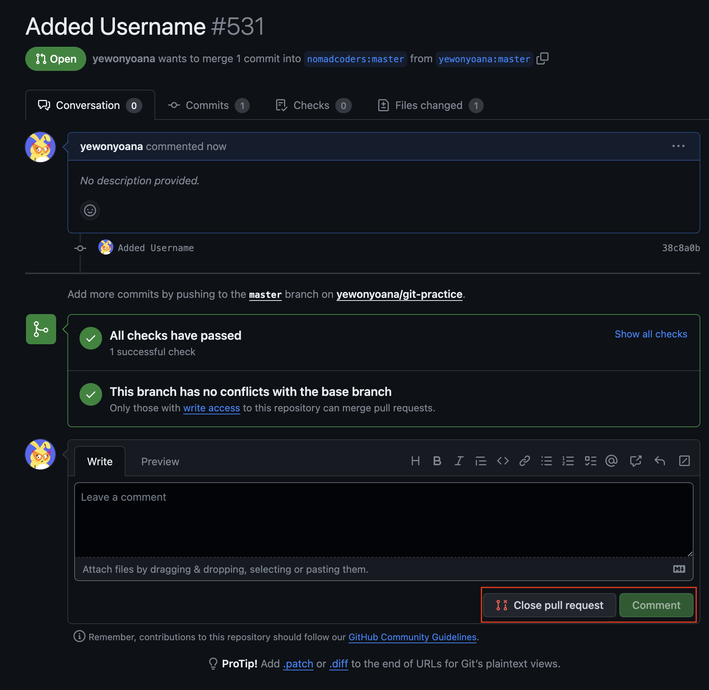
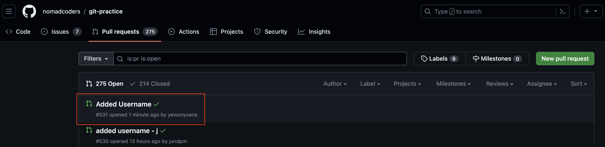
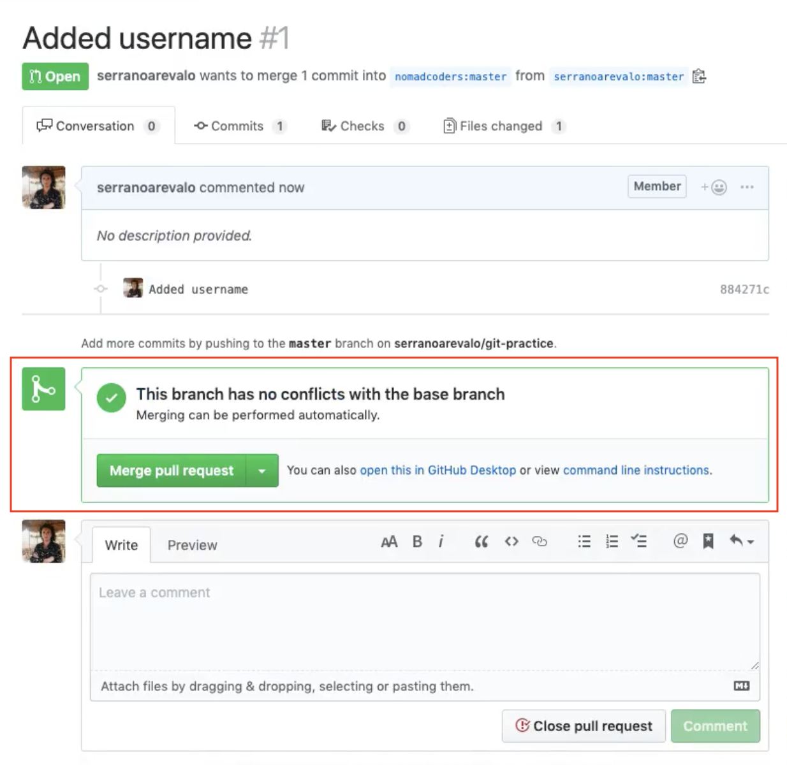

### Pull Request

1. 부모 저장소 `Fork` 후 작업

2. 부모 저장소에서 `Pull Requests` 들어가기

   

3. `New Pull Request` → `Compare Across Fork` → 내 저장소 선택

   

   

   

4. 하단에 보이는 수정 사항이 맞다면 `Create Pull Request`

   

5. 원하는 커밋 이름 작성 후 `Create Pull Request`
   

6. `Pull Request` 성공!

   

   - `Comment` 추가 가능
   - `Close Pull Request`로 풀리퀘 삭제 가능

     

7. 만약 부모 레포지토리의 오너라면 `Merge Pull Request` 버튼이 보이며 풀리퀘한 수정 사항과 머지 가능
   
