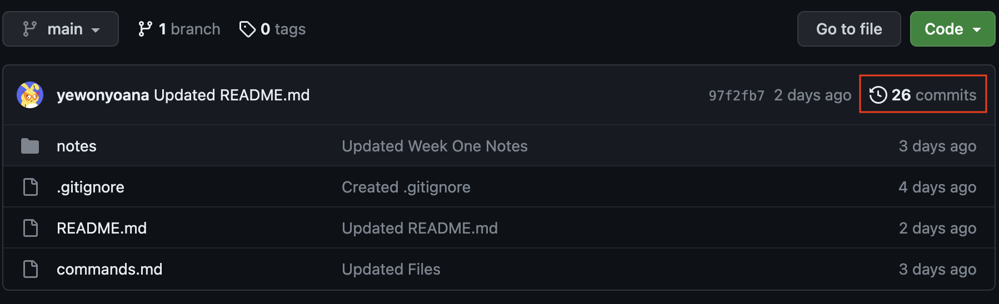
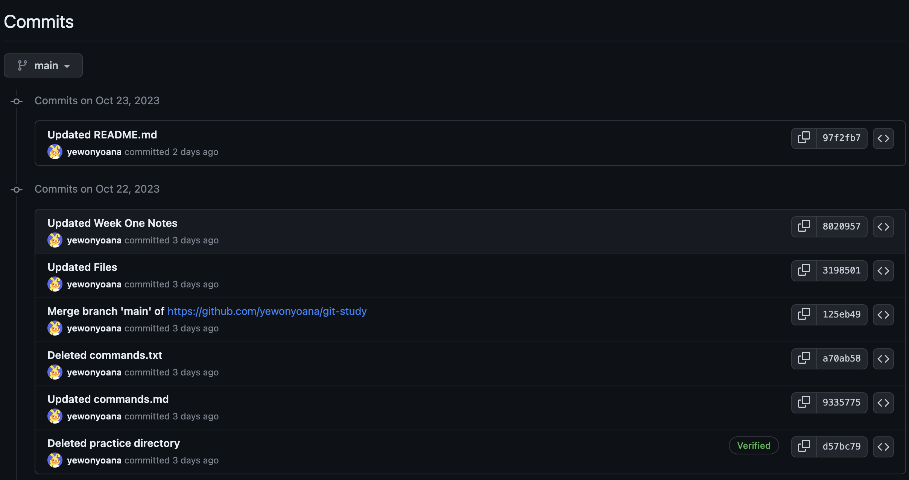
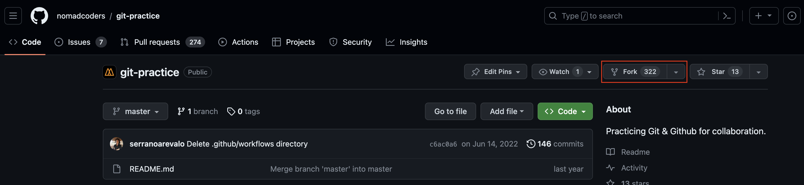
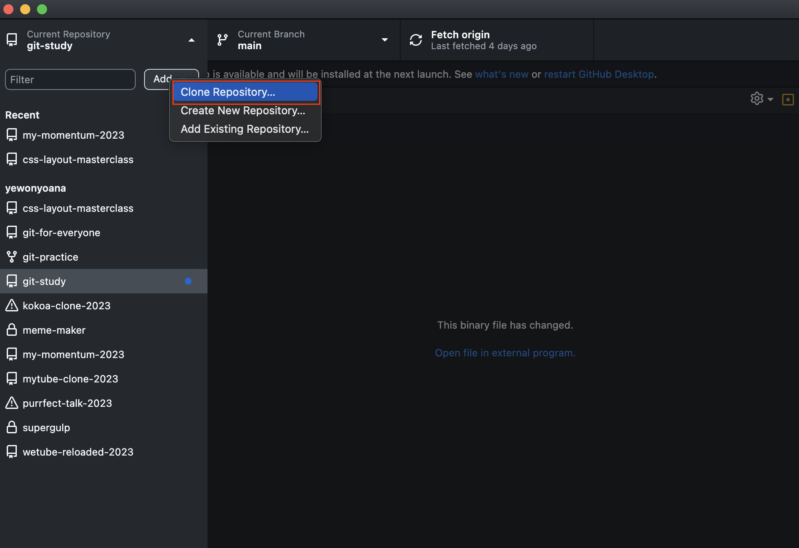
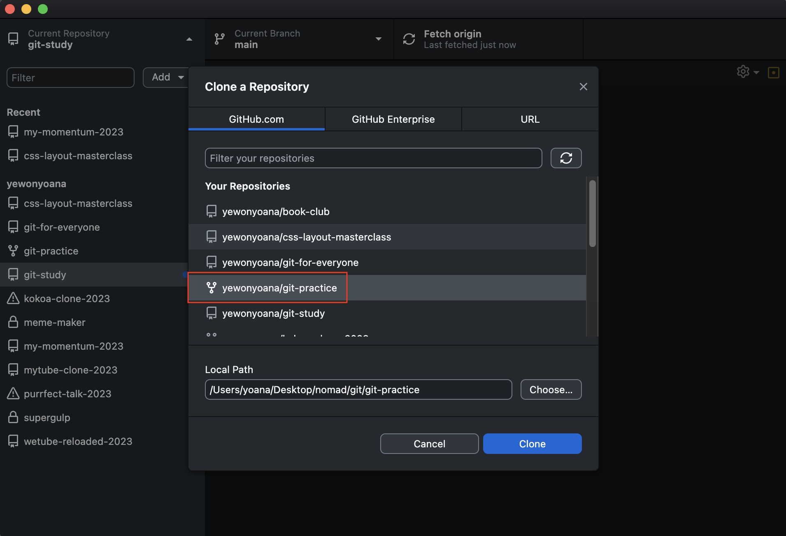
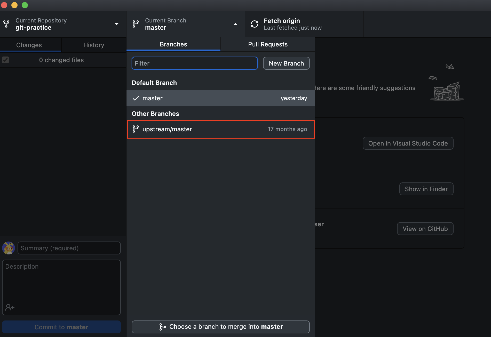
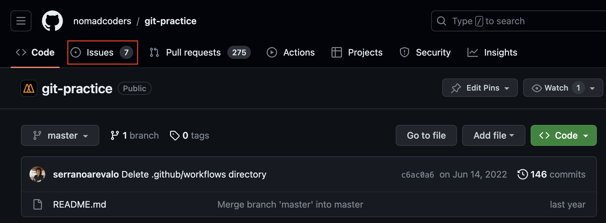

# Week 2

_파일을 수정하고 커밋을 했으면 꼭 푸쉬를 해서 깃헙에 올려야함_

### GitHub

- 깃히스토리 (수정 기록)을 올리는 곳

  - 저장소의 커밋을 클릭하면 해당 저장소의 수정 기록을 볼 수 있음

      
       
      

- 기본 설정으로 README.md (md = markdown) 파일을 읽음

---

### Git Workflow

- **Distributed Environment(분산 환경)?**

  - 깃에서는 각 개발자의 저장소가 하나의 노드이고 중앙 저장소 같은 역할을 할 수 있음
    - 모든 개발자는 다른 개발자의 저장소에 일한 내용을 전송하거나 다른 개발자들이 참여할 수 있도록 자신이 운영하는 저장소 위치를 공개할 수 있음

- 분산 환경에서의 워크플로우
  1. Centralized (중앙집중식) 워크플로우
  2. Integration-Manager 워크플로우
  3. Dictator and Lieutenants 워크플로우

#### 1. Centralized (중앙중입식) 워크플로우

  

- 개발자는 하나의 중앙 저장소를 중심으로 작업

  - 모든 변경 사항은 이 중앙 저장소로 집중 됨
  - 모든 개발자에게 Push 권한을 부여

    1. 개발자가 1, 개발자 2가 중앙 저장소를 각자 복제함
    2. 개발자 1이 코드를 수정 → Commit → Push
    3. 개발자 2가 코드를 수정 → Commit → 개발자 1의 수정 사항을 Fetch 후 Merge (그래야 개발자 1이 작업한 내용을 덮어쓰지 않음! 특히 같은 부분을 수정했다면 개발자 2가 바로 Push를 해도 받아주지 않음) → Push

#### 2. Integration-Manager 워크플로우

  

- 깃을 사용하면 리모트 저장소를 여러 개 운영할 수 있음
  - 읽기 전용 혹은 수정 권한을 줄 수 있음
  - 보통 프로젝트를 대표하는 공식 저장소가 존재
- 보통 깃헙와 같은 허브 사이트에서 주로 사용하는 방식
  1. 프로젝트 Integration-Manager는 프로젝트 메인 저장소에 Push
  2. 프로젝트 기여자는 메인 저장소를 Clone → 수정
  3. 기여자는 자신의 저장소에 Push → 매니저가 접근할 수 있도록 공개 설정 → 수정 사항을 새로운 저장소에 Pull하라고 요청
  4. 매니저는 기여자의 저장소를 리모트 저장소로 등록 → 수정사항을 Merge → 테스트
  5. Merge 한 수정 사항이 잘 작동하면 메인 저장소에 Push
- 장점: 기여자와 Integration-Manager가 각자의 사정에 맞춰 프로젝트를 유지할 수 있음
  - 기여자는 자신의 저장소와 브랜치에서 계속 수정 작업을 할 수 있으며 수정 사항이 프로젝트에 반영되도록 기다릴 필요 없음
  - 매니저는 여유를 가지고 기여자가 Push 해 놓은 커밋을 적절한 시점에 Merge할 수 있음

#### 3. Dictator and Lieutenants 워크플로우

  

- Integration-Manager 워크플로우의 변형된 구조
- 보통 아주 큰 프로젝트를 운영할 때 사용
- Lieutenants: 여러 명의 Integration-Manager가 저장소에 자신이 맡은 부분을 담당
- Benevolent Dictator: 최종 관리자 (Integration-Manager의 보스)
  1. 모든 프로젝트 기여자는 공식 저장소 메인 브랜치에서 Pull → 수정 → 공식 저장소 메인 브랜치 기준으로 자신의 브랜치를 Rebase
  2. Lieutenant들은 기여자들의 수정 사항을 자신이 관리하는 메인 브랜치에 Merge
  3. Dictator는 Lieutenant들의 메인 브랜치를 자신의 메인 브랜치로 Merge → 자신의 메인 브랜치를 Push → 다른 모든 기여자들은 Dictator의 메인 브랜치를 기준으로 Rebase

---

### Forking

- 깃헙에 있는 기능
- Push 권한이 없는 프로젝트 전체를 내 깃헙로 복사하는 것

  

  - 커밋 히스토리, 브랜치, 등 모든게 다 복사 됨
  - 복사된 저장소를 수정할 수 있음
    - 이때, 베이스 저장소는 수정되지 않음
  - BUT 깃헙 데스크탑과 아직 연동이 되지 않았다는 점

- 팀과 협업할 때 유용

---

### Cloning

- Fork한 저장소를 깃헙에서 데스크탑으로 복사하는 것
- 깃헙 데스크탑 이용으로 VSCode에서 작업이 가능해짐

  

  

---

### Upstream Branch

- 만약 베이스 저장소에서 수정 사항이 있었다면 최신버전 유지를 위해 fork한 저장소를 업데이트해야 함
  - Fork를 하면 자동적으로 `upstream` 이란 브랜치가 생성되는데 베이스 저장소와 연결되어 있음
    
    1. `upstream` 선택 후 `Fetch origin`을 클릭하여 베이스 저장소의 최신 수정 사항을 받아옴
    2. 내 `main`과 `upstream`를 `Merge`로 병합
    3. 내 저장소에 베이스 저장소의 최신 수정 사항이 반영됨

---

### Pull Requests

**[How to Pull Request?](/pull_request.md)**
**[Video](https://nomadcoders.co/git-for-beginners/lectures/2042)**

- 복사한 저장소를 수정한 후 베이스 저장소에 수정 사항을 당겨오는 것
  - 반드시 베이스 저장소에 Pull Request를 넣어야함

---

### Issues

- 프로젝트에 생긴 이슈(문제, 버그, 등)를 기록

  

- 개발자가 이슈를 고치고 매니저에게 Pull Request를 넣으면서 이슈 번호, 코멘트와 태그를 넣어서 피드백
- 프로젝트의 매니저가 이슈를 닫을 수 있음

---

### Milestone

- 프로젝트의 버전 업데이트에 해야하는 것들(새로운 기능, 이슈, 등)을 따로 리스트로 모아두는 곳
  - 프로젝트 진행 현황을 볼 수 있음
  - 이슈를 닫을 때 마다 마일스톤에 더 가까워짐
