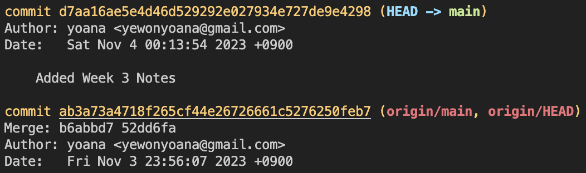
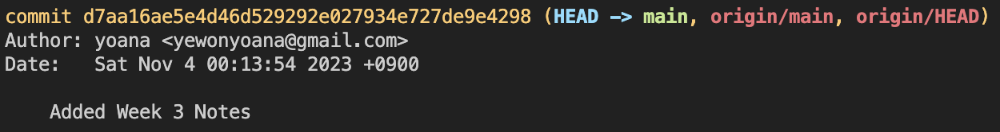
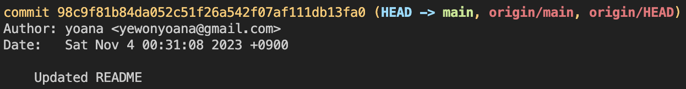
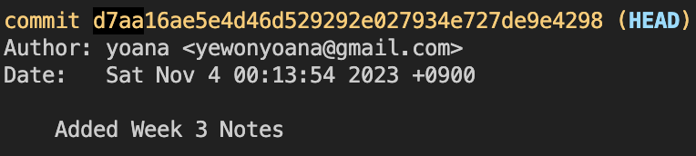

# Week 3

### [Terminal Commands](../commands.md)

---

### M과 U의 차이

- VS Code에서 파일 옆에 M과 U 아이콘들은 무엇인가?

    

  - **M = Modified**
    - 깃이 관찰하고 있는 파일이 수정 되었을 때
  - **U = Untracked**
    - 아직 깃에서 등록되지 않아 관찰되고 있지 않은 파일
    - 커밋을 해야 등록/관찰이 됨

---

### COMMIT HISTORY

- 개발자가 여태 커밋한 기록을 보는 것

  1. `git log`

     

     - `commit # (HEAD -> main)` = 내 컴퓨터
       - 마지막 커밋은 이전 커밋의 내용들이 다 합쳐져 있음
     - `commit # (origin/man)` = 깃헙 저장소

      

     - `commit # (HEAD -> main, origin/man)` = 내 컴퓨터와 깃헙 저장소가 같은 커밋에 있음

  2. `q`

  - `git log` 에서 탈출하기

---

### HEAD

- 지금 시점에 파일이 있는 위치
- HEAD의 위치를 변경할 수 있음

  - 과거 커밋 조회
  - 과거 커밋 변경

---

### CHECKOUT

#### 과거 커밋 조회: `git checkout #`

- `checkout` 은 말 그대로 과거 커밋의 변경사항을 볼 뿐 수정하지는 않음
  1. 현재 위치
     
  2. 이전 파일로 변경
  - git checkout d7aa16ae5e4d46d529292e027934e727de9e4298
    
  3. 다시 제일 최근 커밋으로 돌아가기
  - `git checkout main`

---

### RESET

1. `git reset #`

   - `reset` = delete
   - `#`
     - `HEAD^`
       - `^`의 갯수에 따라 몇개의 커밋 뒤로 갈지 정해짐
       - `HEAD` → 삭제 없음
       - `HEAD^` → 바로 이전 커밋으로 돌아가서 최근 커밋은 삭제
     - `HEAD~`
     - `commit #`

2. `git push origin main --force`
   - 과것 커밋을 삭제를 했을 때 오리진(깃헙)은 내 컴퓨터 파일보다 한 커밋 앞서 있기 때문에 강제로 푸시를 해줘야 함
   - 푸시 후 해당 커밋은 내 컴퓨터에서도 오리진(깃헙)에서도 다 삭제 됨

#### Hard Reset

- `git reset --hard #`

#### Soft Reset

#### Mixed Reset
