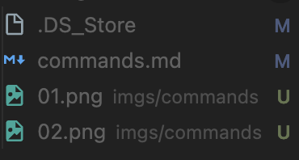

# Week 3

### [Terminal Commands](../commands.md)

---

### M, U

- VS Code에서 파일 옆에 M과 U 아이콘들은 무엇인가?
  - M = Modified
    - 파일이 수정 되었을 때
  - U = Untracked
    - 아직 깃에서 등록되지 않아 관찰되고 있지 않은 파일
    - 커밋을 해야 등록/관찰이 됨
