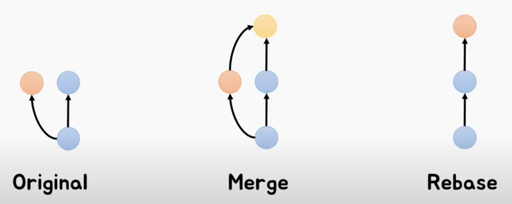

# Week 4

### AMEND COMMITS

- 가장 최근 커밋을 수정
  - 메세지 수정:
    - `git commit --amend -m "message"`
  - 메세지 유지:
    - `git commit --amend --no-edit`

### [IGNORING FILES](https://mygumi.tistory.com/103)

- `.gitignore` 파일 생성
  - 커밋하고 싶지 않은 파일/폴더를 넣으면 해당 파일/폴더는 트랙되지 않고 커밋되지 않음
    - 파일: 파일이름 ➡️ .env
    - 폴더: /폴더이름 ➡️ /images
- `.gitignore` 생성 전에 무시하고 싶은 파일/폴더를 **커밋** 했다면

  - **원격 저장소와 로컬 저장소**에 있는 파일을 삭제

    1. `git rm file` ➡️ `git rm .env`
    2. `git rm -r folder` ➡️ `git rm -r images/`

  - **원격 저장소**에 있는 파일을 삭제

    1. `git rm file --cached`
    2. `git rm -r folder --cached`

### ORIGINS

- 깃헙 외 원격 저장소 사용하기 (bitbucket, gitlab, etc.)
- 원격 저장소 목록 보기
  - `git remote -v`
- 원격 저장소 추가하기
  - `git remote add gitname url`
    - `git remote bitbucket https://~`
- 추가한 원격 저장소에 푸시
  - `git push gitname main`
    - `git push bitbucket main`
- 원격 저장소 삭제하기
  - `git remote remove gitname`
    - `git remote remove bitbucket`

### REBASE

- `git rebase path`
  - `git rebase main`
- 베이스가 되는 커밋을 재설정 (해시값이 변경 됨)

### MERGE vs REBASE

| Merge                                                                 | Rebase                                                                                             |
| --------------------------------------------------------------------- | -------------------------------------------------------------------------------------------------- |
| 브랜치 병합                                                           | 베이스를 재정의하여 커밋 히스토리를 조작                                                           |
| 충돌이 일어나면 한 번에 해걸                                          | 충돌이 일어난 부분부터 하나씩 해결                                                                 |
| 어떤 브랜치에서 병합했는지 알 수 있음                                 | Rebase가 이루어진 브랜치의 커밋이 새로 생성됨. 즉, 같은 커밋이여도 다른 커밋 해시 값을 가지고 있음 |
| 브랜치와 커밋이 많을 경우, 깃 히스토리가 복잡해지고 알아보기 어려워짐 | 하나의 브랜치로 깃 커밋 히스토리를 정리하여 더 깔끔함                                              |

참고:

- [테코톡](https://youtu.be/6nc_0-HWZXU?si=ASVm4_zgzOgFxGbr)
- [리베이스 이해하기](https://blog.naver.com/wishlan/223076935430)

### [CHERRY PICK](https://mine-it-record.tistory.com/650)

- `git cherry-pick hash`
  - `git cherry-pick 8de44fe1a89b63b46c0c527439d0e4ffcd7b9ff5`
- 다른 브랜치에서 필요한 커밋을 골라서 복사해오는 것

#### When to use?

- 협업
  - 다른 개발자가 맡은 부분이 필요해서 병합을 해야하는데 아직 코드가 준비 안되었으면 해당 개발자가 만든 코드만 골라 커밋을 복사
- 버그 수정
  - 새로운 기능을 개발하는데 기존 기능에 버그가 발견되면 해당 버그를 패치하기 위해 명시적 커밋을 만들고 해당 커밋만 골라서 메인 브랜치에 배포
- 반영되지 않은 커밋 복원
  - 실수로 풀리퀘를 병합하기 전에 닫아버리면 해당 커밋을 체리픽으로 다시 살림
- 충돌
  - 작업 중이던 파일과 체리픽해서 가져오는 커밋이 동일할 경우
    1. 충돌 해결
       1. 충돌 코드 수정
       2. `git add path`로 수정된 코드 커밋
       3. `git cherry-pick --continue`로 충돌로 인해 중지 되었던 체리픽 재진행
    2. 중단
       - `git cherry-pick --abort`로 체리픽을 중단하고 이전 상태로 돌아가기

### SQUASH

- `git rebase -i hash/HEAD`
- 여러개의 커밋을 하나의 커밋으로 변경

  - 보통 브랜치 병합 혹은 팀 협업 PR를 할 때 사용

    

#### How to Squash?

1. Rebase
