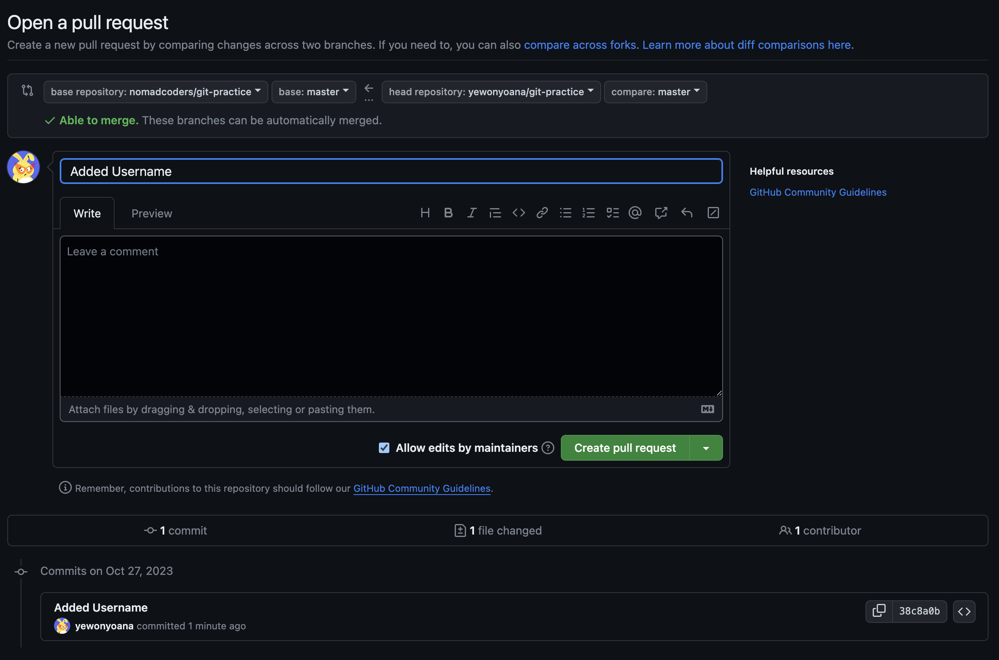

# Week 2

_파일을 수정하고 커밋을 했으면 꼭 푸쉬를 해서 깃헙에 올려야함_

### GitHub

- **GitHub?**

  - 깃히스토리 (수정 기록)을 올리는 곳

    - 레포지토리의 커밋을 클릭하면 해당 레포지토리의 수정 기록을 볼 수 있음

        
         
        

  - 기본 설정으로 README.md 파일을 읽음
    - md = markdown

---

### Git Workflow

- Distributed Environment(분산 환경)?

  - 깃에서는 각 개발자의 저장소가 하나의 노드이고 중앙 저장소 같은 역할을 할 수 있음
    - 모든 개발자는 다른 개발자의 저장소에 일한 내용을 전송하거나 다른 개발자들이 참여할 수 있도록 자신이 운영하는 저장소 위치를 공개할 수 있음

- 분산 환경에서의 워크플로우
  1. Centralized (중앙집중식) 워크플로우
  2. Integration-Manager 워크플로우
  3. Dictator and Lieutenants 워크플로우

1. **Centralized (중앙중입식) 워크플로우**

   

- 개발자는 하나의 중앙 저장소를 중심으로 작업

  - 모든 변경 사항은 이 중앙 저장소로 집중 됨
  - 모든 개발자에게 Push 권한을 부여

    1. 개발자가 2명인 가정하에 중앙 저장소에서 레포를 각자 복제함
    2. 개발자 1이 코드를 수정 → Commit → Push
    3. 개발자 2가 코드를 수정 → Commit → 개발자 1의 수정 사항을 Fetch 후 Merge (그래야 개발자 1이 작업한 내용을 덮어쓰지 않음! 특히 같은 부분을 수정했다면 개발자 2가 바로 Push를 해도 받아주지 않음) → Push

2.  **Integration-Manager 워크플로우**
    

---

### Forking

- **Fork?**

  - 깃헙에 있는 기능

  - 레포지토리 전체를 내 깃헙로 복사하는 것

    
    
    

    - 커밋, 브랜치, 등 모든게 다 복사 됨
    - 복사된 레포지토리를 수정할 수 있음
      - 이때, 부모 레포지토리는 수정되지 않음
    - BUT 깃헙 데스크탑과 아직 연동이 되지 않았다는 점

  - 만약 부모 레포지토리에서 수정사항이 있으면 fork한 레포지토리를 업데이트해야 함

    

  - 팀과 협업할 때 유용

- **깃헙 데스크탑 연동**

  - 복사한 레포지토리를 깃헙에서 데스크탑으로 복사하는 것
  - 깃헙 데스크탑 이용

    
    

    - VSCode에서 작업이 가능해짐

---

### Pull Requests

- **Pull?**

  - 복사한 레포지토리를 수정한 후 부모 레포지토리에 수정 사항을 당겨오는 것
    - 반드시 부모 레포지토리에 Pull Request를 넣어야함

- **Pull Request 넣기**

  1. 부모 레포지토리에서 `Pull Requests` 들어가기

     

  2. `New Pull Request` → `Compare Across Fork` → 내 레포지토리 선택

     

     

     

  3. 하단에 보이는 수정 사항이 맞다면 `Create Pull Request`

     

  4. 원하는 커밋 이름 작성 후 `Create Pull Request`

     

  5. `Pull Request` 성공!

     

     - `Comment` 추가 가능
     - `Close Pull Request`로 풀리퀘 삭제 가능

       

  6. 만약 부모 레포지토리의 오너라면 `Merge Pull Request` 버튼이 보이며 풀리퀘한 수정 사항과 머지 가능

     

---

### Cloning
